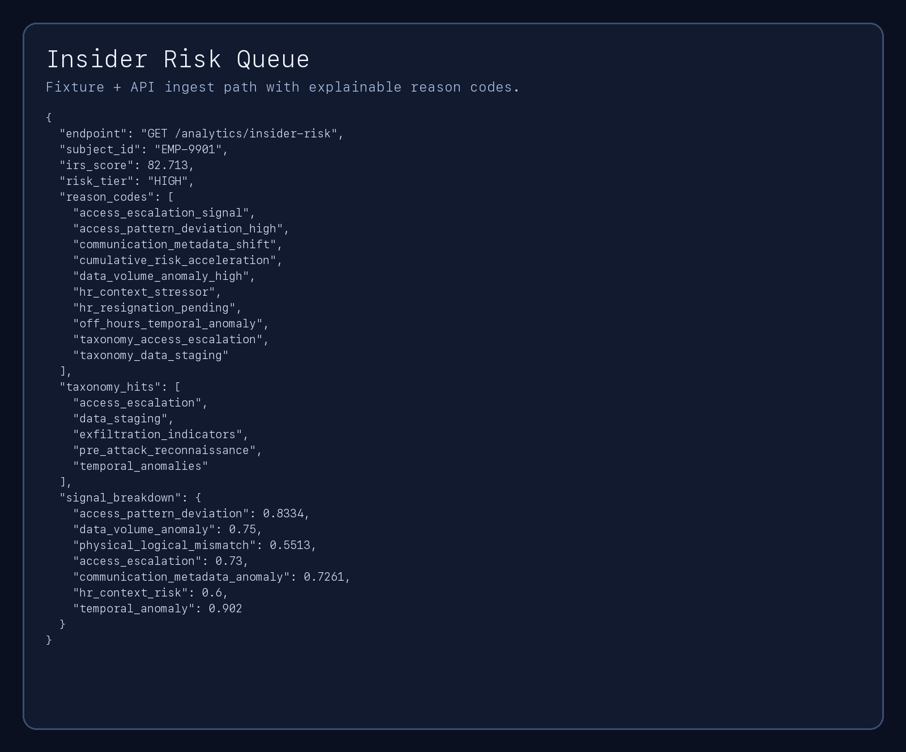
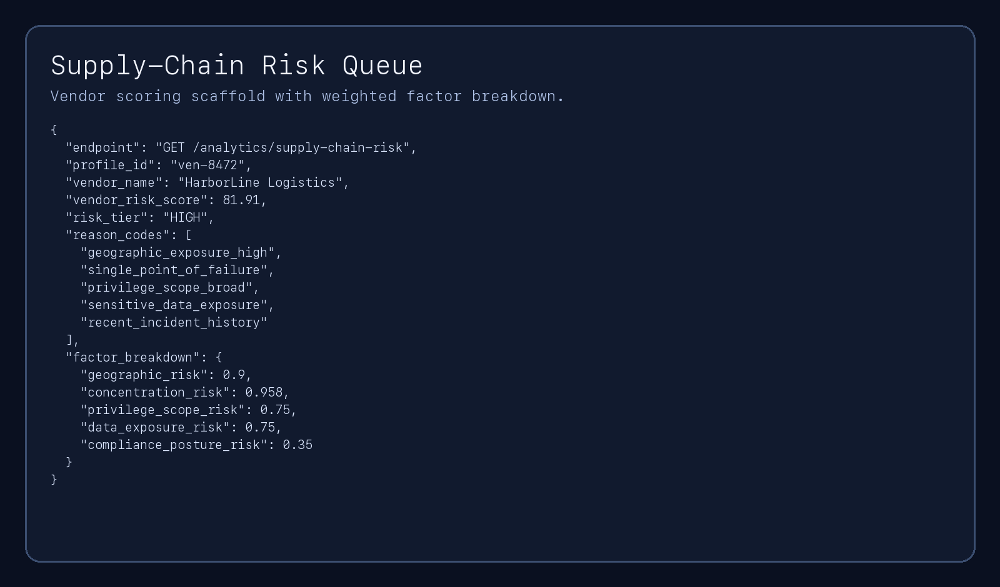
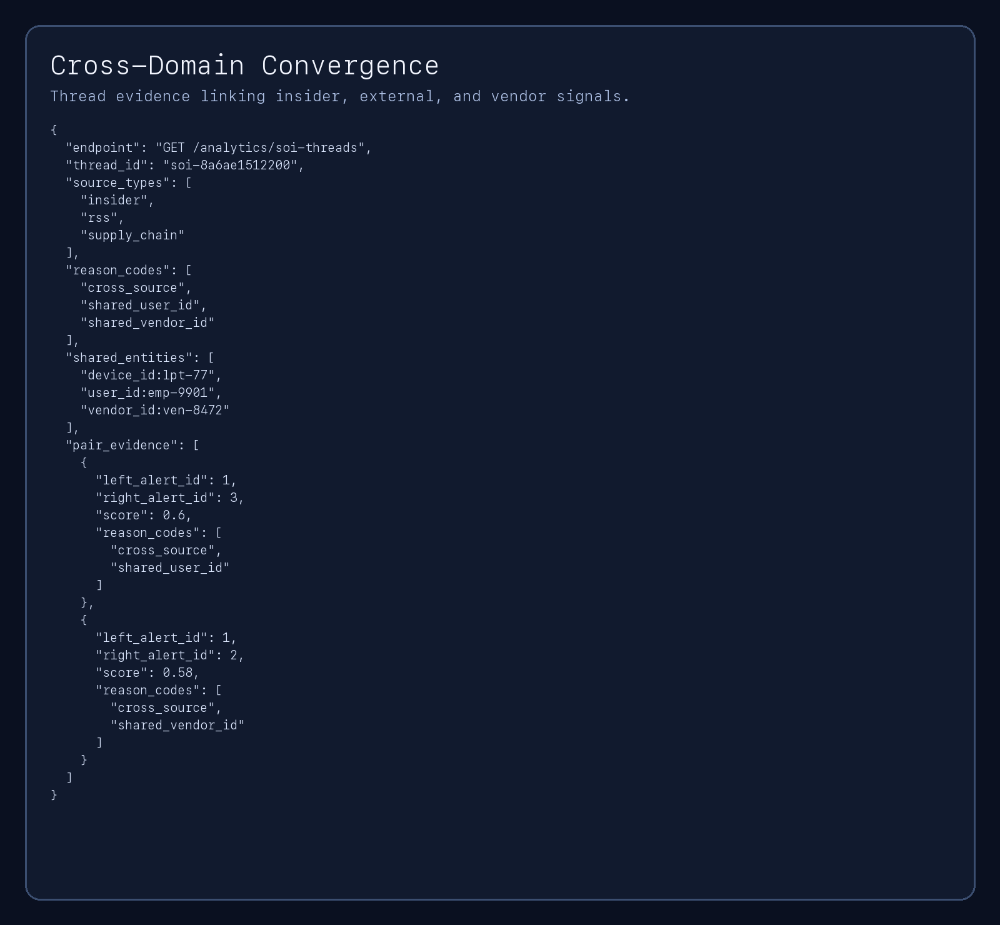
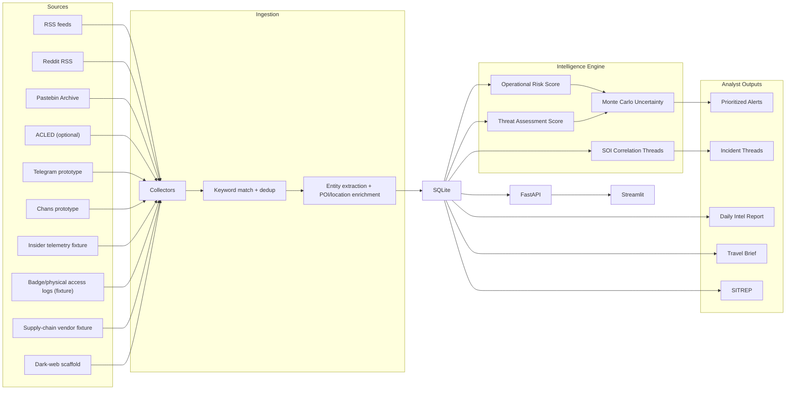
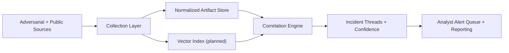

# Protective Intelligence Assistant

[](https://github.com/regimeiq/protective-intelligence-assistant/actions/workflows/ci.yml)


Automated protective-intelligence analysis via cross-domain correlation across cyber, physical, and human-behavior signals.

The platform ingests open-source signals, links related activity into incident threads, scores risk with explainable logic, and produces analyst-ready outputs (daily reports, travel briefs, SITREPs).

Quant hook: implements a multi-weighted scoring engine for cross-platform entity resolution and incident threading.

## Headline Metrics (Latest Local Run - February 27, 2026)

- Correlation linkage quality on hand-labeled scenarios: **Precision 0.8750 / Recall 0.8750 / F1 0.8750** (`make correlation-eval`).
- Insider-risk fixture evaluation (n=10, threshold 55.0): **Precision 1.0000 / Recall 1.0000 / F1 1.0000** (`make insider-eval`).
- Supply-chain fixture evaluation (n=6, threshold 45.0): **Precision 1.0000 / Recall 0.8000 / F1 0.8889** (`make supplychain-eval`).
- Supply-chain scaffold coverage: **6 vendor profiles** across low/guarded/elevated/high tiers (`fixtures/supply_chain_scenarios.json`).
- Collector reliability posture: **heartbeat snapshot + append-only health log** for rapid detection of silent feed failures (`make heartbeat`).
- Engineering verification: **101 automated tests passing** (`pytest -q`).

Note: insider/supply-chain metrics above are fixture benchmark scores, not claims of field production performance.

## What This Project Demonstrates

### Capability Map (90-second scan)

| Capability | Evidence in Repo |
|---|---|
| Insider investigations | `collectors/insider_telemetry.py`, `GET /analytics/insider-risk`, `make insider-eval` |
| Third-party / supply-chain risk | `collectors/supply_chain.py`, `GET /analytics/supply-chain-risk`, `make supplychain-eval` |
| Cross-domain convergence (cyber + physical + human) | SOI threading over `user_id` / `device_id` / `vendor_id` + network entities |
| Detection to analyst action | Correlated threads + scored outputs + casepack + SITREP endpoints |
| Operational rigor and defensibility | source-health telemetry, audit log, explainable reason codes, reproducible eval artifacts |

### Engineering Signals

- Quantitative triage with explainable scoring (ORS, TAS, IRS, uncertainty intervals).
- Correlation logic that reduces analyst noise by clustering related signals into SOI threads.
- Environment-gated and policy-aware collection posture with fixture-first modules for sensitive domains.

### Real-World Ops Mapping

| Enterprise Function | Repo Mapping (Current) | Integration Seam (Next Step) |
|---|---|---|
| EDR telemetry triage | Insider telemetry collector normalizes endpoint/user behavior into explainable IRS factors and reason codes, including API ingest payloads. | Add source-side event signing and immutable collector run IDs for stronger provenance. |
| DLP/exfil monitoring | Data movement signals (`download_gb`, USB writes, cloud upload volume) are scored as exfiltration indicators via fixture or ingest API paths. | Map enterprise DLP event IDs into `scenario_id` lineage and carry them through casepack exports. |
| UEBA risk accumulation | Multi-signal compounding + cumulative acceleration model in `analytics/insider_risk.py`. | Persist rolling baselines by subject/device from production identity/behavior streams. |
| SIEM correlation | SOI threader links cross-domain entities (`user_id`, `device_id`, `vendor_id`, `domain`, `ipv4`, `url`) with pairwise evidence. | Ingest SIEM alert IDs as entity/provenance fields for pivoting and back-reference. |
| SOAR-ready outputs | API endpoints expose scored queues with reason codes (`/analytics/insider-risk`, `/analytics/supply-chain-risk`, `/analytics/soi-threads`). | Add webhook/queue publisher that emits high-tier events to orchestration playbooks. |
| Evidence handling workflow | Casepack artifact captures provenance keys, pairwise linkage evidence, source timeline, and risk context. | Add signed evidence manifest (hash + source timestamp + collector run ID) for chain-of-custody reporting. |

Compact workflow (implemented): detect -> score -> correlate -> produce casepack/SITREP-ready context -> analyst disposition.

## Current Status

Implemented now:

- Multi-source ingestion: RSS, Reddit RSS, Pastebin, optional ACLED.
- Environment-gated prototype collectors: Telegram and chans (fixture-first).
- Insider telemetry collector + IRS analytics endpoint.
- Environment-gated supply-chain collector scaffold + vendor risk endpoint.
- API ingest endpoints for insider telemetry and supply-chain profiles (`POST /ingest/insider-events`, `POST /ingest/supply-chain-profiles`).
- Dark-web collector scaffold wired into pipeline, disabled by default.
- SOI thread correlation endpoint.
- Targeted source preset preview endpoint for event/location watchlist expansion.
- Signal-quality analytics endpoint (precision-oriented TP/FP tracking by source/category).
- Source health telemetry fields and auto-disable controls.
- Hand-labeled correlation evaluation workflow with pairwise precision/recall/F1 metrics.

## Screenshots

Dashboard views:

| Situation Overview | Alert Triage |
|---|---|
|  |  |

| Protectee Risk | Intelligence Analysis |
|---|---|
|  |  |

API output snapshots (for reproducible endpoint evidence):

| Insider Risk Queue | Supply-Chain Risk Queue |
|---|---|
|  |  |

Cross-domain convergence output:



## Architecture

### Implemented Data Flow



### Target v2 Architecture (Roadmap)



Note: vector index/semantic matching is planned, not in the current production path.

## Quant Logic

### 1) Alert Scoring

- ORS combines keyword weight, source credibility, frequency anomaly, recency, and contextual factors.
- TAS applies behavioral threat indicators (fixation, leakage, pathway, targeting specificity, etc.).
- Uncertainty intervals are computed via Monte Carlo for defensible prioritization.

### 2) Entity Resolution and Correlation (Current)

SOI threading uses a weighted pair-link model with explicit reason codes.
Alerts are linked into a thread when cumulative linkage confidence clears the threshold.
This same threader now accepts external OSINT alerts, insider telemetry-derived alerts, and supply-chain risk alerts in one pipeline.

Cross-domain convergence examples:

- cyber signal (`domain`, `ipv4`, `url`) + insider access anomaly in the same time window
- physical/logical mismatch (badge vs login) + external reconnaissance chatter
- human behavioral stressors + staged data movement + external indicator overlap

Primary linkage signals:

- shared actor handle
- shared POI hit
- shared non-actor entities (`domain`, `ipv4`, `url`, `user_id`, `device_id`, `vendor_id`)
- matched-term temporal overlap
- source fingerprint overlap
- cross-source corroboration bonus
- tight temporal proximity bonus
- lightweight linguistic overlap bonus

Output fields include:

- `thread_confidence`
- `reason_codes`
- `pair_evidence`
- analyst timeline by source/type/time

### 3) Signal Taxonomy

The system collects and scores signals as indicator classes, not only keyword hits.

| Signal Class | Examples |
|---|---|
| Intent-to-harm | direct threats, attack statements, explicit harm language |
| Targeting specificity | named principal/facility, route/time references |
| Pathway/capability | logistics, access points, recon indicators, operational planning |
| PII/Exposure | doxxing, leak references, personal data exposure cues |
| Operational coordination | protest/disruption mobilization and coordination language |
| Grievance/Sentiment | escalating grievance, fixation, hostile framing (supporting signal) |

## Quick Start

```bash
pip install -r requirements.txt
make clean && make init && make scrape
```

### 90-Second Reviewer Path

```bash
pip install -r requirements.txt
make demo
make casepack
```

Expected artifacts:

- `docs/demo_daily_report.md`
- `docs/demo_travel_brief.md`
- `docs/incident_thread_casepack.md`

Start services:

```bash
# terminal 1
make api

# terminal 2
make dashboard
```

Optional demo artifacts:

```bash
make demo
```

Generate an analyst-ready incident thread case pack:

```bash
make casepack
```

Refresh README screenshots (insider + supply chain + convergence):

```bash
make screenshots
```

`make casepack` runs in an isolated temporary database so it does not modify your operational/local alert corpus.

Generate a compact benchmark table artifact:

```bash
make benchmark
```

Generate hand-labeled correlation precision/recall metrics:

```bash
make correlation-eval
```

Generate insider-risk precision/recall metrics:

```bash
make insider-eval
```

Generate supply-chain precision/recall metrics:

```bash
make supplychain-eval
```

Generate an operational source-health heartbeat snapshot + append-only log:

```bash
make heartbeat
```

## Environment-Gated Collection Modes

Prototype and high-risk collectors are disabled by default.

- `PI_ENABLE_TELEGRAM_COLLECTOR=1` enables Telegram prototype collector.
- `PI_ENABLE_CHANS_COLLECTOR=1` enables chans prototype collector.
- `PI_ENABLE_SUPPLY_CHAIN=1` enables supply-chain fixture scaffold collector.
- `PI_ENABLE_DARKWEB_COLLECTOR=1` enables dark-web scaffold path (still non-operational by design).

Safety defaults and optics:

- Insider and supply-chain modules are fixture-first and synthetic by default.
- No real HR systems, private communications content, or production identity datasets are required for demo flows.
- High-risk collection paths remain explicitly opt-in via environment gating.

Source reliability controls:

- `PI_SOURCE_AUTO_DISABLE=1` enables automatic disabling after repeated failures.
- `PI_SOURCE_FAIL_DISABLE_THRESHOLD=5` sets consecutive-failure threshold.

## Key Endpoints

### Correlation and Intelligence

- `GET /analytics/soi-threads`
- `GET /analytics/insider-risk`
- `GET /analytics/supply-chain-risk`
- `GET /analytics/source-presets`
- `GET /analytics/signal-quality`
- `GET /analytics/source-health`

### Collection Triggers

- `POST /scrape/telegram`
- `POST /scrape/chans`
- `POST /scrape/insider`
- `POST /scrape/supply-chain`
- `POST /scrape/social-media`
- `POST /ingest/insider-events`
- `POST /ingest/supply-chain-profiles`

### Core Analyst Workflow

- `GET /alerts`
- `GET /alerts/{id}/score?uncertainty=1`
- `POST /alerts/{id}/disposition`
- `GET /pois/{id}/assessment`
- `POST /briefs/travel`
- `POST /sitreps/generate/poi/{id}`

## Example: Pull Incident Threads

```bash
curl "http://localhost:8000/analytics/soi-threads?days=14&window_hours=72&min_cluster_size=2"
```

Generated case-pack artifact:

- `docs/incident_thread_casepack.md`

## Endpoint Output Shapes

`GET /analytics/insider-risk` returns:

```json
[
  {
    "subject_id": "EMP-7415",
    "irs_score": 73.5,
    "risk_tier": "HIGH",
    "reason_codes": ["cumulative_risk_acceleration", "shared_user_id"],
    "signal_breakdown": {"access_pattern_deviation": 0.71},
    "taxonomy_hits": ["data_staging", "exfiltration_indicators"]
  }
]
```

`GET /analytics/supply-chain-risk` returns:

```json
[
  {
    "profile_id": "sc-004",
    "vendor_name": "Aster Cloud Analytics",
    "vendor_risk_score": 83.3,
    "risk_tier": "HIGH",
    "reason_codes": ["single_point_of_failure", "privilege_scope_broad"],
    "factor_breakdown": {"geographic_risk": 0.65}
  }
]
```

`GET /analytics/soi-threads` returns:

```json
[
  {
    "thread_id": "soi-...",
    "source_types": ["insider", "rss", "supply_chain"],
    "reason_codes": ["shared_user_id", "shared_vendor_id", "cross_source"],
    "pair_evidence": [{"left_alert_id": 1, "right_alert_id": 2, "score": 0.74}]
  }
]
```

`POST /ingest/insider-events` returns:

```json
{
  "source": "insider_ingest_api",
  "processed": 2,
  "ingested": 1,
  "updated": 0,
  "invalid": 1,
  "subjects_assessed": 1
}
```

`POST /ingest/supply-chain-profiles` returns:

```json
{
  "source": "supply_chain_ingest_api",
  "processed": 2,
  "ingested": 1,
  "updated": 0,
  "invalid": 1,
  "profiles_scored": 1
}
```

## Security and Data Handling Disclosure

### API Key Handling

- API key auth uses `PI_API_KEY` (or legacy `OSINT_API_KEY`).
- If key enforcement is enabled (`PI_REQUIRE_API_KEY=1`), endpoints with auth dependency require `X-API-Key`.
- Local dev can run without auth when keys are unset.

### Request/Audit Controls

- Request IDs are assigned per request (`X-Request-ID` support).
- Mutation requests are written to `audit_log` with method/path/status/duration and client metadata.
- Security headers are added (`X-Content-Type-Options`, `X-Frame-Options`).

### PII/Protectee Redaction

- Generated intel products can redact active POI names/aliases via `REDACT_PERSON_ENTITIES=1`.
- Redaction is applied to reports/briefs/SITREPs before output.

### Retention

- Raw alert content retention is bounded by `RAW_CONTENT_RETENTION_DAYS` (default 30).
- Purge command nulls old raw content while preserving structured analytical metadata.

## Data Science Validation

Reproducible evaluation memo:

```bash
make evaluate
```

Output:

- `docs/evaluation_memo.md`
- `docs/benchmark_table.md` (via `make benchmark`)
- `docs/correlation_eval.md` (via `make correlation-eval`; dataset includes ambiguous/near-miss cases to prevent inflated metrics)
- `docs/insider_eval.md` (via `make insider-eval`)
- `docs/supply_chain_eval.md` (via `make supplychain-eval`)

Current repo also includes:

- backtesting workflow
- ML comparison endpoint (`GET /analytics/ml-comparison`)
- precision/recall analytics endpoint (`GET /analytics/evaluation`)
- correlation-engine pairwise eval on hand-labeled cases (`fixtures/correlation_eval_cases.json`)
- insider-risk eval on hand-labeled behavioral fixtures (`fixtures/insider_scenarios.json`)
- supply-chain eval on hand-labeled vendor fixtures (`fixtures/supply_chain_scenarios.json`)
- benchmark index and reproducibility notes (`benchmarks/README.md`)

## Operational Health & Observability

Current persisted fields include:

- `fail_streak`
- `last_status`
- `last_error`
- `last_success_at`
- `last_failure_at`
- `last_collection_count`
- `last_latency_ms`
- `disabled_reason`

`/analytics/source-health` redacts raw error text by default (`include_errors=1` to include error details).

The heartbeat workflow is designed for fast detection of collector degradation at run cadence:

- heartbeat markdown snapshot for analyst/operator review
- append-only JSONL log for trend analysis and auditing
- fail streak + auto-disable state to prevent quiet reliance on dead feeds
- observer-style collector instrumentation (`monitoring/collector_health.py`) to keep collector business logic cleaner

Planned telemetry additions:

- uptime rollups and SLO reporting

Heartbeat artifacts:

- `docs/source_health_heartbeat.md` (latest markdown snapshot)
- `docs/source_health_heartbeat.jsonl` (append-only heartbeat log; local artifact)

Run heartbeat on demand:

```bash
make heartbeat
```

## Deployment

Containerized options are already included:

- `Dockerfile`
- `docker-compose.yml`

Run locally:

```bash
docker compose up --build
```

## Modular Code Layout

Incremental modularization is now in place:

- `collectors/` for ingestion facades and pipeline entrypoints
- `processor/` for correlation/processing facades
- `evals/` for benchmark and signal-quality evaluation facades
- `monitoring/` for operational heartbeat and source-health reliability telemetry
- `benchmarks/` for benchmark catalog and reproducibility notes

## Testing

```bash
python -m pytest tests/ -v
```

Current suite status: 101 passing tests.

## Legal and Operational Note

This repository is an analyst-assistance platform. Any operational collection on adversarial or platform-restricted sources must follow organizational legal review, platform terms, and applicable privacy/civil-liberties policies before activation.
