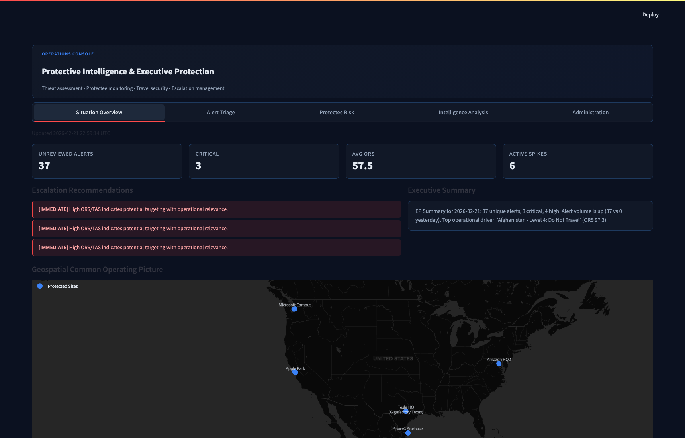
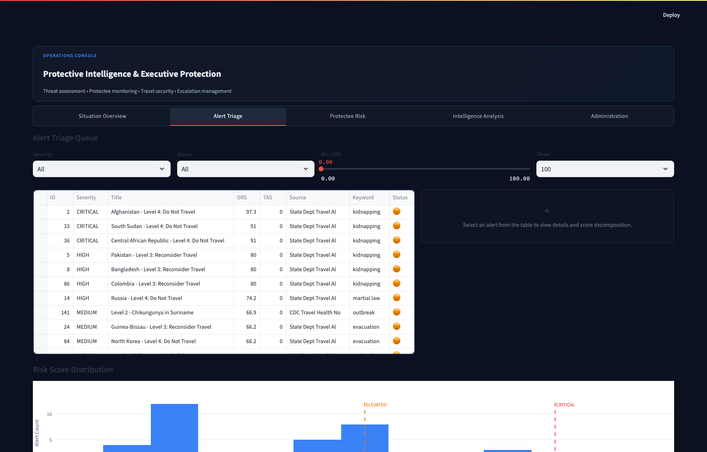
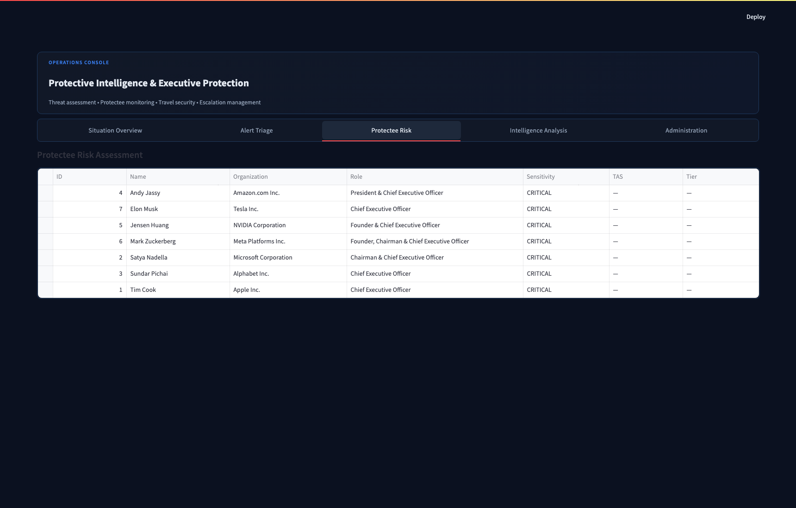
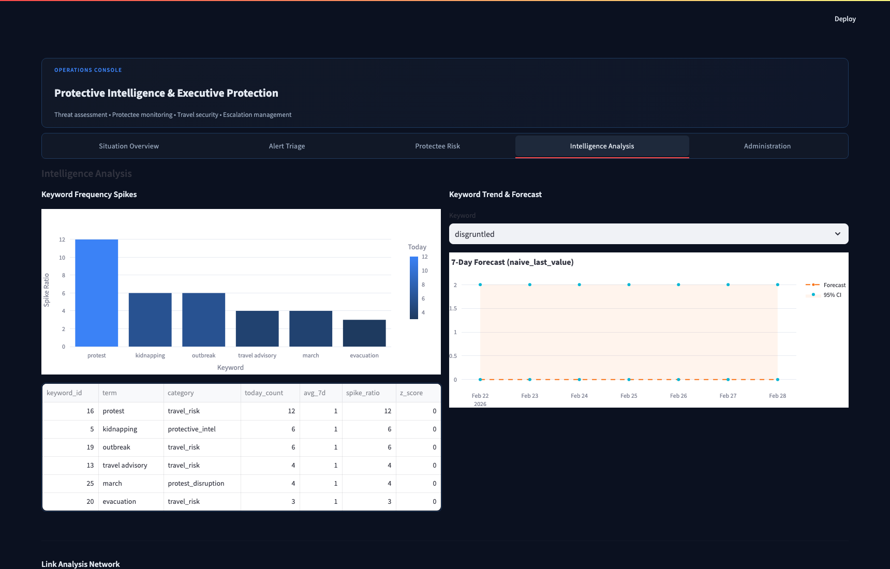
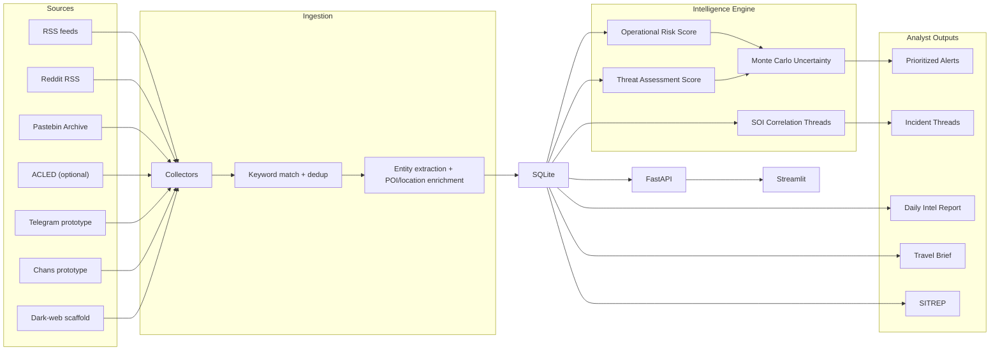
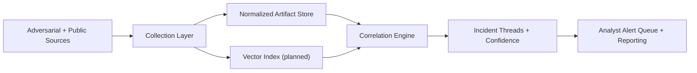

# Protective Intelligence Assistant

Automated behavioral threat assessment via multi-source correlation for protective intelligence workflows.

The platform ingests open-source signals, links related activity into incident threads, scores risk with explainable logic, and produces analyst-ready outputs (daily reports, travel briefs, SITREPs).

Quant hook: implements a multi-weighted scoring engine for cross-platform entity resolution and incident threading.

## What This Project Demonstrates

- Protective intelligence workflow design, not just alert scraping.
- Quantitative triage with explainable scoring (ORS, TAS, uncertainty intervals).
- Correlation logic that reduces analyst noise by clustering related signals into Subject of Interest (SOI) threads.
- Operational reliability patterns (source health, fail streaks, auto-disable of dead feeds).
- High-consequence uptime posture: heartbeat snapshots + append-only health logs to surface silent collector failures.
- Production-minded API, auditability, and environment-gated collectors.

## Current Status

Implemented now:

- Multi-source ingestion: RSS, Reddit RSS, Pastebin, optional ACLED.
- Environment-gated prototype collectors: Telegram and chans (fixture-first).
- Dark-web collector scaffold wired into pipeline, disabled by default.
- SOI thread correlation endpoint.
- Targeted source preset preview endpoint for event/location watchlist expansion.
- Signal-quality analytics endpoint (precision-oriented TP/FP tracking by source/category).
- Source health telemetry fields and auto-disable controls.
- Hand-labeled correlation evaluation workflow with pairwise precision/recall/F1 metrics.

## Screenshots

| Situation Overview | Alert Triage |
|---|---|
|  |  |

| Protectee Risk | Intelligence Analysis |
|---|---|
|  |  |

## Architecture

### Implemented Data Flow



### Target v2 Architecture (Roadmap)



Note: vector index/semantic matching is planned, not in the current production path.

## Quant Logic

### 1) Alert Scoring

- ORS combines keyword weight, source credibility, frequency anomaly, recency, and contextual factors.
- TAS applies behavioral threat indicators (fixation, leakage, pathway, targeting specificity, etc.).
- Uncertainty intervals are computed via Monte Carlo for defensible prioritization.

### 2) Entity Resolution and Correlation (Current)

SOI threading uses a weighted pair-link model with explicit reason codes.
Alerts are linked into a thread when cumulative linkage confidence clears the threshold.

Primary linkage signals:

- shared actor handle
- shared POI hit
- shared non-actor entities (`domain`, `ipv4`, `url`)
- matched-term temporal overlap
- source fingerprint overlap
- cross-source corroboration bonus
- tight temporal proximity bonus
- lightweight linguistic overlap bonus

Output fields include:

- `thread_confidence`
- `reason_codes`
- `pair_evidence`
- analyst timeline by source/type/time

### 3) Signal Taxonomy

The system collects and scores signals as indicator classes, not only keyword hits.

| Signal Class | Examples |
|---|---|
| Intent-to-harm | direct threats, attack statements, explicit harm language |
| Targeting specificity | named principal/facility, route/time references |
| Pathway/capability | logistics, access points, recon indicators, operational planning |
| PII/Exposure | doxxing, leak references, personal data exposure cues |
| Operational coordination | protest/disruption mobilization and coordination language |
| Grievance/Sentiment | escalating grievance, fixation, hostile framing (supporting signal) |

## Quick Start

```bash
pip install -r requirements.txt
make clean && make init && make scrape
```

Start services:

```bash
# terminal 1
make api

# terminal 2
make dashboard
```

Optional demo artifacts:

```bash
make demo
```

Generate an analyst-ready incident thread case pack:

```bash
make casepack
```

`make casepack` runs in an isolated temporary database so it does not modify your operational/local alert corpus.

Generate a compact benchmark table for portfolio/interview use:

```bash
make benchmark
```

Generate hand-labeled correlation precision/recall metrics:

```bash
make correlation-eval
```

Generate an operational source-health heartbeat snapshot + append-only log:

```bash
make heartbeat
```

## Environment-Gated Collection Modes

Prototype and high-risk collectors are disabled by default.

- `PI_ENABLE_TELEGRAM_COLLECTOR=1` enables Telegram prototype collector.
- `PI_ENABLE_CHANS_COLLECTOR=1` enables chans prototype collector.
- `PI_ENABLE_DARKWEB_COLLECTOR=1` enables dark-web scaffold path (still non-operational by design).

Source reliability controls:

- `PI_SOURCE_AUTO_DISABLE=1` enables automatic disabling after repeated failures.
- `PI_SOURCE_FAIL_DISABLE_THRESHOLD=5` sets consecutive-failure threshold.

## Key Endpoints

### Correlation and Intelligence

- `GET /analytics/soi-threads`
- `GET /analytics/source-presets`
- `GET /analytics/signal-quality`
- `GET /analytics/source-health`

### Collection Triggers

- `POST /scrape/telegram`
- `POST /scrape/chans`
- `POST /scrape/social-media`

### Core Analyst Workflow

- `GET /alerts`
- `GET /alerts/{id}/score?uncertainty=1`
- `POST /alerts/{id}/disposition`
- `GET /pois/{id}/assessment`
- `POST /briefs/travel`
- `POST /sitreps/generate/poi/{id}`

## Example: Pull Incident Threads

```bash
curl "http://localhost:8000/analytics/soi-threads?days=14&window_hours=72&min_cluster_size=2"
```

Generated case-pack artifact:

- `docs/incident_thread_casepack.md`

## Security and Data Handling Disclosure

### API Key Handling

- API key auth uses `PI_API_KEY` (or legacy `OSINT_API_KEY`).
- If key enforcement is enabled (`PI_REQUIRE_API_KEY=1`), endpoints with auth dependency require `X-API-Key`.
- Local dev can run without auth when keys are unset.

### Request/Audit Controls

- Request IDs are assigned per request (`X-Request-ID` support).
- Mutation requests are written to `audit_log` with method/path/status/duration and client metadata.
- Security headers are added (`X-Content-Type-Options`, `X-Frame-Options`).

### PII/Protectee Redaction

- Generated intel products can redact active POI names/aliases via `REDACT_PERSON_ENTITIES=1`.
- Redaction is applied to reports/briefs/SITREPs before output.

### Retention

- Raw alert content retention is bounded by `RAW_CONTENT_RETENTION_DAYS` (default 30).
- Purge command nulls old raw content while preserving structured analytical metadata.

## Data Science Validation

Reproducible evaluation memo:

```bash
make evaluate
```

Output:

- `docs/evaluation_memo.md`
- `docs/benchmark_table.md` (via `make benchmark`)
- `docs/correlation_eval.md` (via `make correlation-eval`; dataset includes ambiguous/near-miss cases to prevent inflated metrics)

Current repo also includes:

- backtesting workflow
- ML comparison endpoint (`GET /analytics/ml-comparison`)
- precision/recall analytics endpoint (`GET /analytics/evaluation`)
- correlation-engine pairwise eval on hand-labeled cases (`fixtures/correlation_eval_cases.json`)

## Source Health Telemetry

Current persisted fields include:

- `fail_streak`
- `last_status`
- `last_error`
- `last_success_at`
- `last_failure_at`
- `last_collection_count`
- `last_latency_ms`
- `disabled_reason`

`/analytics/source-health` redacts raw error text by default (`include_errors=1` to include error details).

Planned telemetry additions:

- uptime rollups and SLO reporting

Heartbeat artifacts:

- `docs/source_health_heartbeat.md` (latest markdown snapshot)
- `docs/source_health_heartbeat.jsonl` (append-only heartbeat log; local artifact)

Run heartbeat on demand:

```bash
make heartbeat
```

## Deployment

Containerized options are already included:

- `Dockerfile`
- `docker-compose.yml`

Run locally:

```bash
docker compose up --build
```

## Modular Code Layout

Incremental modularization is now in place:

- `collectors/` for ingestion facades and pipeline entrypoints
- `processor/` for correlation/processing facades
- `evals/` for benchmark and signal-quality evaluation facades
- `monitoring/` for operational heartbeat and source-health reliability telemetry

## Testing

```bash
python -m pytest tests/ -v
```

Current suite status: 85 passing tests.

## Legal and Operational Note

This repository is an analyst-assistance platform. Any operational collection on adversarial or platform-restricted sources must follow organizational legal review, platform terms, and applicable privacy/civil-liberties policies before activation.
