# Protective Intelligence Assistant

A **Protective Intelligence / Executive Protection** analyst-assistance platform.
Ingests open-source intelligence, scores alerts against protectee/facility context,
and produces actionable EP outputs: daily intelligence reports, travel briefs,
SITREPs, behavioral threat assessments, and escalation recommendations.

> **Lane**: Protective intelligence, travel security, corporate security.
> All cyber/CTI content has been removed — this is a pure EP platform.

> **Note:** Demo protectees are public-figure CEOs used for realistic context.
> No actual intelligence collection was performed against these individuals.

---

## Screenshots

| Situation Overview | Alert Triage |
|---|---|
|  |  |

| Protectee Risk | Intelligence Analysis |
|---|---|
|  |  |

Protectee Risk screenshot is shown in a cold-start state (`TAS`/`Tier` dashes in roster); those fields populate after POI-linked alerts are assessed.

---

## Architecture

```mermaid
flowchart LR
    subgraph Sources
        RSS[State Dept / CDC]
        GDELT[GDELT PI-EP Watch]
        Reddit[Reddit RSS]
        Paste[Pastebin Archive]
        ACLED[ACLED &#40;optional&#41;]
        DarkWeb[Dark Web Connector &#40;scaffold, disabled&#41;]
    end

    subgraph Ingestion
        Scraper[Keyword Match<br/>+ Dedup]
        Extract[Entity Extraction<br/>+ Geocoding]
    end

    subgraph Scoring
        ORS[ORS<br/>Multi-Factor Risk]
        TAS[TAS<br/>TRAP-Lite Flags]
        Pathway[Pathway-to-Violence<br/>Behavioral Assessment]
        MC[Monte Carlo<br/>Uncertainty]
    end

    subgraph Products
        Report[Daily Intel Report]
        Brief[Travel Brief]
        SITREP[SITREP]
        Escalation[Escalation Rec]
    end

    subgraph Stack
        DB[(SQLite)]
        API[FastAPI<br/>30+ Endpoints]
        UI[Streamlit<br/>Dashboard]
    end

    RSS & GDELT & Reddit & Paste & ACLED & DarkWeb --> Scraper
    Scraper --> Extract --> DB
    DB --> ORS & TAS & Pathway
    ORS & TAS & Pathway --> MC --> DB
    DB --> API --> UI
    API --> Report & Brief & SITREP & Escalation
```



---

## 3-Minute Demo

```bash
git clone <repo-url>
cd protective-intelligence-assistant
pip install -r requirements.txt
make demo
```

Or use the demo script:

```bash
bash scripts/demo.sh        # init + demo artifacts
bash scripts/demo.sh --run   # also starts API + dashboard
```

**Demo artifacts generated:**

| Artifact | Path |
|---|---|
| Daily Intelligence Report | `docs/demo_daily_report.md` |
| Travel Brief | `docs/demo_travel_brief.md` |
| Protectee View (SVG) | `docs/protectee_view.svg` |
| Map View (SVG) | `docs/map_view.svg` |

**Stack URLs:**

| Service | URL |
|---|---|
| API (FastAPI) | `http://localhost:8000` |
| Dashboard (Streamlit) | `http://localhost:8501` |

---

## Quick Start (No Demo)

1. Install dependencies, initialize the database, and ingest alerts.
```bash
pip install -r requirements.txt
make clean && make init && make scrape
```
`make init` seeds the DB from `config/watchlist.yaml` (protectees, locations, keywords, sources).
`make scrape` pulls live alerts from those sources (State Dept, CDC, GDELT, Reddit, Pastebin).

2. Start API and dashboard in separate terminals.
```bash
# Terminal 1
make api        # http://localhost:8000

# Terminal 2
make dashboard  # http://localhost:8501
```

3. Re-scrape anytime for fresh alerts.
```bash
make scrape
```

4. If you edit `config/watchlist.yaml` without wanting a full reset:
```bash
make sync       # upserts config changes into existing DB
```

5. Optional: enable API auth in non-local environments.
```bash
export PI_API_KEY="change-me"
export PI_REQUIRE_API_KEY=1
```
If `PI_REQUIRE_API_KEY=1`, requests are rejected unless `X-API-Key` matches.

6. Generate the quantitative evaluation memo (precision/recall, FP reduction, analyst-time savings):
```bash
make evaluate
```
Memo output: [`docs/evaluation_memo.md`](docs/evaluation_memo.md)

---

## What It Does

### Core EP Workflow
1. **Collect** alerts from safe sources (RSS / Reddit / Pastebin / GDELT / optional ACLED)
2. **Match** EP taxonomy keywords (protective_intel, protest_disruption, travel_risk, insider_workplace)
3. **Extract** IOCs/entities (regex-first; optional spaCy NER for locations)
4. **Match protectees** (POIs) using conservative alias matching
5. **Resolve locations** (regex + optional geocoding with cache/rate limiting)
6. **Compute** ORS (Operational Risk Score) + TAS (Threat Assessment Score)
7. **Produce** EP intelligence products: daily report, travel briefs, SITREPs

### Dark-Web Readiness (Scaffold)
- `sources.darkweb` is now supported in `config/watchlist.yaml` for planned source registration.
- Collector path is wired into `make scrape`, but disabled by default.
- Enable flag: `PI_ENABLE_DARKWEB_COLLECTOR=1` (currently still returns no-op by design).
- Current status: integration scaffold only, pending legal/ToS review, source QA, and hardened collector implementation.

### EP Intelligence Products
- **Daily Report** — Automated intelligence summary with executive overview, top risks, emerging themes, escalation recommendations
- **Travel Brief** — Destination-specific risk assessment with threat overlay
- **SITREP** — Event-triggered situation report (POI escalation, facility breach)
- **Behavioral Threat Assessment** — Pathway-to-violence longitudinal tracking for threat subjects

---

## Scoring Model

### Operational Risk Score (ORS)
Persisted as `alerts.ors_score`. Multi-factor score for alert triage.

**Drivers:** recency · source Bayesian credibility · frequency anomaly (z-score) · EP category factor · proximity to protected locations · event adjacency · POI hit contribution

### Threat Assessment Score (TAS)
Persisted as `alerts.tas_score` and `poi_assessments.tas_score`.

**TRAP-lite flags:**
- `fixation` — Persistent recurring attention across multiple days
- `energy_burst` — Sudden spike in mention frequency (z ≥ 2.0)
- `leakage` — Language signaling intent or timeline
- `pathway` — References to operational details (routes, schedules, weapons)
- `targeting_specificity` — Location + time reference combination

### Escalation Tiers (Config-Driven)
Defined in `config/watchlist.yaml`:

| Tier | Threshold | Response Window | Notify |
|---|---|---|---|
| CRITICAL | ≥ 85 | 30 minutes | detail_leader, intel_manager |
| ELEVATED | ≥ 65 | 4 hours | intel_analyst |
| ROUTINE | ≥ 40 | 24 hours | — |
| LOW | ≥ 0 | N/A | — |

### Behavioral Threat Assessment (Pathway-to-Violence)
8 weighted indicators for threat subject tracking:

`grievance_level` · `fixation_level` · `identification_level` · `novel_aggression` · `energy_burst` · `leakage` · `last_resort` · `directly_communicated_threat`

Composite score (0–100) maps to risk tiers: CRITICAL / ELEVATED / ROUTINE / LOW.
Longitudinal trend detection: increasing / stable / decreasing.

### Uncertainty
Monte Carlo engine in `analytics/uncertainty.py`:
- ORS intervals: `/alerts/{id}/score?uncertainty=1`
- TAS intervals: included in `poi_assessments.evidence_json.interval`

### Model Evaluation

Reproducible via `make evaluate` → [`docs/evaluation_memo.md`](docs/evaluation_memo.md).
Initial benchmark: 35 EP scenarios, LOO-CV for ML classifier.

| Metric | Naive Baseline | Multi-Factor (Rules) | ML Classifier (LOO-CV) |
|---|---:|---:|---:|
| Severity Accuracy | 51.4% | **68.6%** | **68.6%** |
| Escalation Precision | 0.619 | **0.867** | **0.867** |
| Escalation Recall | 0.812 | 0.812 | 0.812 |
| Escalation F1 | 0.703 | **0.839** | **0.839** |
| False Positives | 8 | **2** | **2** |

ML classifier: TF-IDF(alert text) + numeric features → Logistic Regression.
Rules and ML achieve identical aggregate metrics but make different errors on 12/35 scenarios, suggesting ensemble potential. See [`analytics/ml_classifier.py`](analytics/ml_classifier.py).

---

## Data Model

### EP Tables (12)
| Table | Purpose |
|---|---|
| `pois` | Protectees / persons of interest |
| `poi_aliases` | Alias matching for name disambiguation |
| `poi_hits` | Links alerts to POIs |
| `poi_assessments` | TAS assessment history |
| `protected_locations` | Facilities, residences, venues |
| `alert_locations` | Geocoded alert locations |
| `alert_proximity` | Distance from alerts to protected locations |
| `events` | Scheduled events (travel, conferences) |
| `event_risk_snapshots` | Point-in-time risk for events |
| `threat_subjects` | Behavioral threat tracking subjects |
| `threat_subject_assessments` | Pathway-to-violence assessments |
| `sitreps` | Situation reports |

### Supporting Tables
`alerts` · `alert_scores` · `alert_entities` · `sources` · `keywords` · `keyword_frequency` · `threat_actors` · `intelligence_reports` · `travel_briefs` · `dispositions` · `retention_log` · `audit_log` · `geocode_cache` · `scrape_runs` · `evaluation_metrics`

---

## API (v5.0.0 — 30+ endpoints)

### Alert Triage
| Method | Endpoint | Description |
|---|---|---|
| GET | `/alerts` | Filtered alert feed with ORS/TAS |
| GET | `/alerts/summary` | Dashboard-ready summary stats |
| GET | `/alerts/{id}/score?uncertainty=1` | Score breakdown + Monte Carlo interval |
| GET | `/alerts/{id}/entities` | Extracted entities |
| GET | `/alerts/{id}/iocs` | IOC evidence |
| PATCH | `/alerts/{id}/review` | Mark reviewed |
| PATCH | `/alerts/{id}/classify` | TP/FP classification → Bayesian update |
| POST | `/alerts/{id}/disposition` | Analyst disposition |
| POST | `/alerts/rescore` | Re-score all unreviewed alerts |

### Protective Intelligence
| Method | Endpoint | Description |
|---|---|---|
| GET | `/pois` | List protectees with aliases |
| POST | `/pois` | Register new POI |
| GET | `/pois/{id}/hits` | POI alert hits |
| GET | `/pois/{id}/assessment` | TAS + escalation explanation |
| GET | `/locations/protected` | Protected locations |
| POST | `/locations/protected` | Add facility/venue |
| GET | `/locations/protected/{id}/alerts` | Alerts near a facility |
| GET | `/analytics/map` | Map overlay (alerts + facilities) |
| POST | `/briefs/travel` | Generate travel brief |
| GET | `/briefs/travel` | List travel briefs |

### Threat Subjects (Behavioral Assessment)
| Method | Endpoint | Description |
|---|---|---|
| GET | `/threat-subjects` | List subjects with latest pathway score |
| POST | `/threat-subjects` | Register threat subject |
| GET | `/threat-subjects/{id}` | Subject detail + assessment history |
| POST | `/threat-subjects/{id}/assess` | Submit behavioral assessment |
| GET | `/threat-subjects/{id}/history` | Longitudinal assessment trend |

### SITREPs
| Method | Endpoint | Description |
|---|---|---|
| GET | `/sitreps` | List SITREPs |
| GET | `/sitreps/{id}` | Single SITREP with parsed JSON fields |
| POST | `/sitreps/generate/poi/{id}` | Generate POI escalation SITREP |
| POST | `/sitreps/generate/facility/{loc_id}/alert/{alert_id}` | Generate facility breach SITREP |
| PATCH | `/sitreps/{id}/issue` | Mark SITREP as issued |

### Analytics
| Method | Endpoint | Description |
|---|---|---|
| GET | `/analytics/spikes` | Keyword frequency spikes (z-score) |
| GET | `/analytics/keyword-trend/{id}` | Daily keyword frequency |
| GET | `/analytics/forecast/keyword/{id}` | Keyword frequency forecast |
| GET | `/analytics/evaluation` | Precision/recall/F1 per source |
| GET | `/analytics/performance` | Scrape run benchmarks |
| GET | `/analytics/backtest` | Golden dataset scoring comparison |
| GET | `/analytics/duplicates` | Content dedup statistics |
| GET | `/analytics/graph` | Link-analysis graph |
| GET | `/analytics/escalation-tiers` | Configured escalation thresholds |
| POST | `/scrape/social-media` | Trigger social media monitor |

### Operations / Reliability
| Method | Endpoint | Description |
|---|---|---|
| GET | `/healthz` | Liveness probe + uptime |
| GET | `/readyz` | Readiness probe (DB checks) |
| GET | `/metrics` | Operational counters (requires API key) |

### Example Calls

```bash
# POI assessment with escalation explanation
curl "http://localhost:8000/pois/1/assessment?window_days=14&force=1"

# ORS/TAS breakdown + uncertainty interval
curl "http://localhost:8000/alerts/1/score?uncertainty=1&n=500"

# Create and assess a threat subject
curl -X POST "http://localhost:8000/threat-subjects" \
  -H "Content-Type: application/json" \
  -d '{"name":"Unknown Subject Alpha","notes":"Fixated individual identified via social media"}'

curl -X POST "http://localhost:8000/threat-subjects/1/assess" \
  -H "Content-Type: application/json" \
  -d '{"grievance_level":0.8,"fixation_level":0.9,"leakage":0.6}'

# Generate a SITREP for POI escalation
curl -X POST "http://localhost:8000/sitreps/generate/poi/1"

# Travel brief
curl -X POST "http://localhost:8000/briefs/travel" \
  -H "Content-Type: application/json" \
  -d '{"destination":"San Francisco, CA","start_dt":"2026-02-21","end_dt":"2026-02-24"}'
```

---

## Watchlist Configuration

Main config: `config/watchlist.yaml`

| Section | Purpose |
|---|---|
| `keywords` | EP taxonomy (protective_intel, protest_disruption, travel_risk, insider_workplace) |
| `pois` | Protectees with aliases, org, role, sensitivity (default: Mag 7 CEOs) |
| `protected_locations` | Facilities with coordinates and radius (default: Apple Park, Microsoft, Googleplex, etc.) |
| `events` | Scheduled events with POI linkage (default: WWDC, GTC, Build, etc.) |
| `sources` | RSS/Reddit/Pastebin feed configuration |
| `escalation_tiers` | Threshold/notify/action/response_window tiers |

---

## Social Media Monitoring

Stub architecture for social media ingestion with platform configs for X/Twitter, Instagram, Telegram, and TikTok. In demo mode, loads fixture data from `fixtures/social_media_fixtures.json` (8 posts covering direct threat, hostile surveillance, fixated individual, protest, false positive, escalation, travel advisory, insider threat).

Production integration requires appropriate API credentials and legal/ToS compliance.

---

## Governance

### Redaction
- `REDACT_PERSON_ENTITIES=true` (default) — redacts POI names in exported reports/briefs

### Retention
- `RAW_CONTENT_RETENTION_DAYS=30` (default) — purge via `python run.py purge`

### Authentication
- `PI_API_KEY` — when set, all non-root API endpoints require `X-API-Key` header
- When unset, auth is disabled (local development mode)
- Dashboard requests will automatically send `X-API-Key` when `PI_API_KEY` is set in the dashboard process environment.

---

## Testing

```bash
# Full test suite (59 tests)
python -m pytest tests/ -v

# Smoke test
bash scripts/smoke_test.sh

# Make targets
make test    # pytest
make smoke   # smoke test
```

**Test coverage:**
- `test_ep_golden.py` — 33 golden EP cases (name disambiguation, alias matching, proximity, TAS, escalation tiers, behavioral assessment, SITREPs, social media, escalation explanation)
- `test_ep_workflow.py` — POI/assessment/travel brief API integration
- `test_scoring_pipeline.py` — ORS scoring, recency, frequency snapshots
- `test_p0_features.py` — Entity extraction, uncertainty, forecasting, graph
- `test_api_regressions.py` — API edge cases and regression guards
- `test_config_seeding.py` — Watchlist YAML → DB seeding

---

## Safe Source Policy

**Shipped by default:**
- RSS (State Dept / CDC / GDELT PI-EP watch)
- Reddit RSS (r/OSINT, r/security)
- Pastebin archive monitor
- Optional ACLED connector (env-gated: `ACLED_API_KEY` + `ACLED_EMAIL`)

**Stubs only (require legal compliance):**
- Telegram/chans collectors (`scraper/connectors/*_stub.py`)
- Social media platforms (X, Instagram, TikTok)

---

## Limitations & Next Steps

### Evaluation Scope
- Current benchmark is **35 synthetic scenarios** (initial benchmark). 3 of 11 misclassifications
  are label-ambiguous boundary cases (analyst-judgment calls, not model failures).
  Full error analysis: [`docs/error_analysis.md`](docs/error_analysis.md).
- Both models lack **geographic/contextual relevance** — a kidnapping report in a country with no
  protectee presence still scores high on keyword weight alone.

### ML Production Path
- ML classifier runs as an evaluation tool only; it does not yet score alerts in the operational pipeline.
- Planned rollout: shadow scoring → disagreement queue → analyst adjudication → retraining → promotion.
  Full design: [`docs/ml_rollout.md`](docs/ml_rollout.md).

### Scale (v2 Architecture)
Current stack (SQLite, single-process) is appropriate for local analysis and portfolio demonstration.
Production migration path:

| Component | Current | v2 Target |
|---|---|---|
| Database | SQLite | PostgreSQL + connection pooling |
| Task queue | Synchronous `make scrape` | Celery / ARQ workers with scheduled scrapes |
| ML retraining | Manual (`make evaluate`) | Scheduled batch retrain with accuracy gating |
| Observability | `audit_log` table, `/metrics` endpoint | Prometheus metrics + Grafana dashboards |
| Deployment | Local Makefile | Docker Compose → Kubernetes (API + workers + dashboard) |
| Model serving | In-process sklearn `predict()` | Separate model service with A/B traffic split |

---

## Notes

- This is an **analyst-assistance tool**, not an autonomous enforcement or SaaS platform.
- Location geocoding is cache-first (`geocode_cache`) and only triggered for relevant alerts.
- All intelligence products are generated as drafts pending analyst review.
