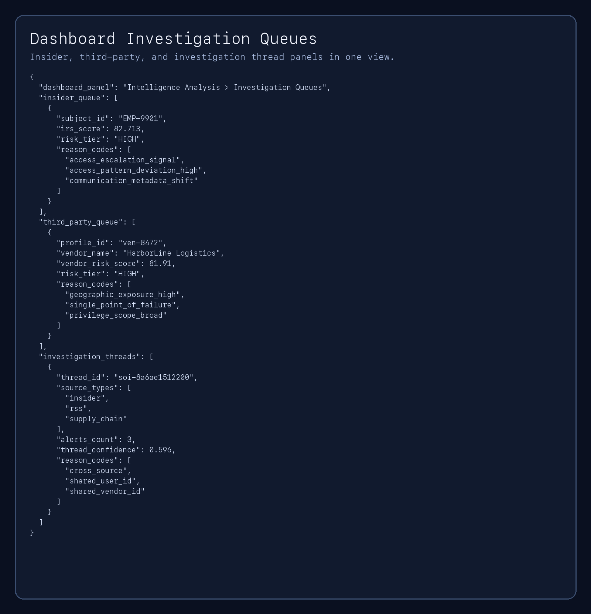
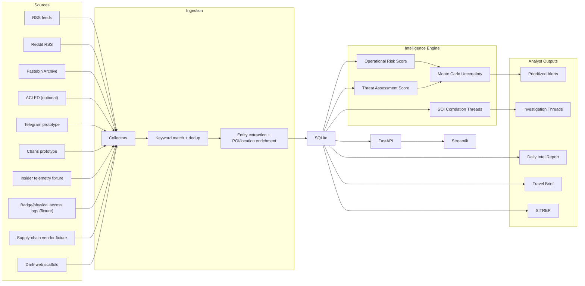

# Protective Intelligence Assistant

[](https://github.com/regimeiq/protective-intelligence-assistant/actions/workflows/ci.yml)


Protective-intelligence decision support via cross-domain correlation across cyber, physical, and human-behavior signals.

Capability classes: Global Security Investigations / Protective Intelligence / Insider Risk / Third-Party Risk.

The platform ingests open-source signals, links related activity into investigation threads, scores risk with explainable logic, and produces analyst-ready outputs (daily reports, travel briefs, SITREPs).

## 90-Second Proof

- External threat monitoring (OSINT ingestion).
- Insider risk analytics (fixture UEBA-style telemetry).
- Third-party/vendor exposure scoring (env-gated scaffold).
- Cross-domain investigation threading over insider + external + vendor pivots.

Run one command:

```bash
make demo
```

(`make demo` runs an offline, fixture-only collector pipeline + scoring + investigation artifact generation.)

`make demo` outputs:

- `docs/sample_casepack.md`
- `out/sitrep.md`
- `docs/incident_thread_casepack.md`
- `docs/demo_daily_report.md`
- `docs/demo_travel_brief.md`

Committed synthetic casepack (detection -> thread -> reason codes/evidence -> disposition -> controls): `docs/sample_casepack.md`

Supporting docs: `docs/use_cases.md` · `docs/architecture.md` · `docs/evaluation.md`

## Scope Guardrails (PI-First)

- Primary mission: protective-intelligence analysis for protectees, facilities, and travel risk.
- Insider and vendor modules are supporting risk vectors that feed the same correlation and prioritization pipeline.
- Fixture-driven telemetry simulation is used for high-sensitivity domains in this public repo.
- Env-gated restricted-platform prototypes are opt-in and disabled by default.
- This repo is not a full UEBA suite, TPRM platform, or SOC replacement.

## Headline Metrics (Latest Local Run - February 27, 2026)

- Correlation linkage quality on hand-labeled scenarios: **Precision 0.8750 / Recall 0.8750 / F1 0.8750** (`make correlation-eval`).
- Insider-risk fixture evaluation (n=10, threshold 55.0): **Precision 1.0000 / Recall 1.0000 / F1 1.0000** (`make insider-eval`).
- Supply-chain fixture evaluation (n=6, threshold 45.0): **Precision 1.0000 / Recall 0.8000 / F1 0.8889** (`make supplychain-eval`).
- Supply-chain scaffold coverage: **6 vendor profiles** across low/guarded/elevated/high tiers (`fixtures/supply_chain_scenarios.json`).
- Collector reliability posture: **heartbeat snapshot + append-only health log** for rapid detection of silent feed failures (`make heartbeat`).
- Engineering verification: **103 automated tests passing** (`pytest -q`).

Note: insider/supply-chain metrics above are fixture benchmark scores, not claims of field production performance.

## What This Project Demonstrates

All capabilities below are implemented as one protective-intelligence pipeline, not separate standalone products.

### Capability Map (90-second scan)

| Capability | Evidence in Repo |
|---|---|
| Insider investigations | `collectors/insider_telemetry.py`, `GET /analytics/insider-risk`, `make insider-eval` |
| Third-party / supply-chain risk | `collectors/supply_chain.py`, `GET /analytics/supply-chain-risk`, `make supplychain-eval` |
| Cross-domain convergence (cyber + physical + human) | SOI threading over `user_id` / `device_id` / `vendor_id` + network entities |
| Detection to analyst action | Correlated threads + scored outputs + casepack + SITREP endpoints |
| Operational rigor and defensibility | source-health telemetry, audit log, explainable reason codes, reproducible eval artifacts |

### Intelligence Lifecycle Coverage

| Lifecycle Phase | Implementation |
|---|---|
| **Requirements & Direction** | Configurable watchlist (`config/watchlist.yaml`) with keyword priorities, POIs, protected locations, and event calendars. Source presets endpoint for tasked collection expansion. |
| **Collection** | Multi-INT ingestion: OSINT feeds (RSS, Reddit, Pastebin, ACLED), HUMINT-adjacent behavioral telemetry (insider UEBA simulation), supply-chain due-diligence profiles. Environment-gated restricted-platform prototypes. |
| **Processing & Exploitation** | Entity extraction (POI, IOC, location), deduplication, keyword matching, geocoding enrichment, source credibility weighting via Bayesian priors. |
| **Analysis & Production** | Multi-factor risk scoring (ORS, TAS, IRS), SOI correlation threading with reason-coded pair evidence, TRAP-18-informed behavioral assessment, Monte Carlo uncertainty quantification. |
| **Dissemination** | Analyst-ready products: daily intelligence reports, protectee travel briefs, SITREPs, investigation casepacks. SOAR-consumable JSON queues. |
| **Feedback & Evaluation** | Disposition tracking (TP/FP/escalation), signal-quality precision analytics, hand-labeled eval workflows, source-health telemetry with auto-disable. |

### Analytical Frameworks

- **TRAP-18 (adapted):** TAS scoring applies Fixation, Action Imperative (energy burst), Leakage, Pathway, and Targeting Specificity as weighted behavioral flags for protectee threat assessment.
- **Pathway-to-violence model:** `behavioral_assessment.py` scores eight pathway indicators (grievance, fixation, identification, novel aggression, energy burst, leakage, last resort, directly communicated threat) with escalation trend detection.
- **Insider threat behavioral indicators:** IRS weights seven factors aligned with NITTF/CISA observable categories — access pattern deviation, data volume anomaly, physical/logical mismatch, access escalation, communication metadata shift, HR context risk, temporal anomaly.
- **Supply-chain risk decomposition:** Five-factor model covering geographic exposure, concentration/single-point-of-failure, privilege scope, data sensitivity classification, and compliance posture — consistent with NIST SP 800-161 risk factor taxonomy.

### Operational Mapping (Keyword Scan)

- **EDR / UEBA:** insider telemetry normalization + IRS reason-coded scoring.
- **DLP / Exfil:** data movement anomaly factors (`download_gb`, USB, cloud upload).
- **SIEM / Correlation:** SOI threading over `user_id`, `device_id`, `vendor_id`, `domain`, `ipv4`, `url`.
- **SOAR-ready outputs:** scored queues from `/analytics/insider-risk`, `/analytics/supply-chain-risk`, `/analytics/soi-threads`.
- **Evidence handling:** casepack provenance keys + pairwise linkage evidence + timeline reconstruction.
- **Analyst workflow:** detect → enrich → correlate → score → triage → disposition → feedback loop.

## Screenshots

Dashboard views:

| Situation Overview | Alert Triage |
|---|---|
|  |  |

| Protectee Risk | Intelligence Analysis |
|---|---|
|  |  |

API output snapshots (for reproducible endpoint evidence):

| Insider Risk Queue | Supply-Chain Risk Queue |
|---|---|
|  |  |

Investigation queues payload snapshot:



Cross-domain convergence output:


## Architecture

### Implemented Data Flow



## Scoring and Correlation

### 1) Alert Scoring

- ORS combines keyword weight, source credibility, frequency anomaly, recency, and contextual factors.
- TAS applies behavioral threat indicators (fixation, leakage, pathway, targeting specificity, etc.).
- Uncertainty intervals are computed via Monte Carlo for defensible prioritization.

### 2) Entity Resolution and Correlation (Current)

SOI threading uses a weighted pair-link model with explicit reason codes.
Alerts are linked into a thread when cumulative linkage confidence clears the threshold.
This same threader now accepts external OSINT alerts, insider telemetry-derived alerts, and supply-chain risk alerts in one pipeline.

Cross-domain convergence examples:

- cyber signal (`domain`, `ipv4`, `url`) + insider access anomaly in the same time window
- physical/logical mismatch (badge vs login) + external reconnaissance chatter
- human behavioral stressors + staged data movement + external indicator overlap

Primary linkage signals:

- shared actor handle
- shared POI hit
- shared non-actor entities (`domain`, `ipv4`, `url`, `user_id`, `device_id`, `vendor_id`)
- matched-term temporal overlap
- source fingerprint overlap
- cross-source corroboration bonus
- tight temporal proximity bonus
- lightweight linguistic overlap bonus

Output fields include:

- `thread_confidence`
- `reason_codes`
- `pair_evidence`
- analyst timeline by source/type/time

### 3) Evidence Model

- **Reason codes:** deterministic explanations for why alerts were linked/scored.
- **Pair evidence:** edge-level linkage details between alerts with supporting scores.
- **Provenance keys:** shared entities (`user_id`, `device_id`, `vendor_id`, network artifacts) carried through casepack output.
- **Audit log:** mutation paths recorded in `audit_log` for disposition/change accountability.

### 4) Signal Taxonomy

The system collects and scores signals as indicator classes, not only keyword hits.

| Signal Class | Examples |
|---|---|
| Intent-to-harm | direct threats, attack statements, explicit harm language |
| Targeting specificity | named principal/facility, route/time references |
| Pathway/capability | logistics, access points, recon indicators, operational planning |
| PII/Exposure | doxxing, leak references, personal data exposure cues |
| Operational coordination | protest/disruption mobilization and coordination language |
| Grievance/Sentiment | escalating grievance, fixation, hostile framing (supporting signal) |

## Quick Start

```bash
pip install -r requirements.txt
make demo          # 90-second offline proof (fixtures only)
make api           # terminal 1 — http://localhost:8000
make dashboard     # terminal 2 — http://localhost:8501
```

### Other Make Targets

```bash
make casepack          # investigation thread case pack (isolated DB)
make correlation-eval  # hand-labeled linkage precision/recall/F1
make insider-eval      # insider-risk fixture evaluation
make supplychain-eval  # supply-chain fixture evaluation
make benchmark         # compact metrics table
make heartbeat         # source-health snapshot + append-only log
make screenshots       # refresh dashboard screenshots
```

## Environment-Gated Collection Modes

Prototype and high-risk collectors are disabled by default.

- `PI_ENABLE_TELEGRAM_COLLECTOR=1` enables Telegram prototype collector.
- `PI_ENABLE_CHANS_COLLECTOR=1` enables chans prototype collector.
- `PI_ENABLE_SUPPLY_CHAIN=1` enables supply-chain fixture scaffold collector.
- `PI_ENABLE_DARKWEB_COLLECTOR=1` enables dark-web scaffold path (still non-operational by design).

Safety defaults and optics:

- Insider and supply-chain modules are fixture-first and synthetic by default.
- No real HR systems, private communications content, or production identity datasets are required for demo flows.
- High-risk collection paths remain explicitly opt-in via environment gating.

Source reliability controls:

- `PI_SOURCE_AUTO_DISABLE=1` enables automatic disabling after repeated failures.
- `PI_SOURCE_FAIL_DISABLE_THRESHOLD=5` sets consecutive-failure threshold.

## Key Endpoints

### Correlation and Intelligence

- `GET /analytics/soi-threads`
- `GET /analytics/insider-risk`
- `GET /analytics/supply-chain-risk`
- `GET /analytics/source-presets`
- `GET /analytics/signal-quality`
- `GET /analytics/source-health`

### Collection Triggers

- `POST /scrape/telegram`
- `POST /scrape/chans`
- `POST /scrape/insider`
- `POST /scrape/supply-chain`
- `POST /scrape/social-media`
- `POST /ingest/insider-events`
- `POST /ingest/supply-chain-profiles`

### Core Analyst Workflow

- `GET /alerts`
- `GET /alerts/{alert_id}/score?uncertainty=1`
- `POST /alerts/{alert_id}/disposition`
- `GET /pois/{poi_id}/assessment`
- `POST /briefs/travel`
- `POST /sitreps/generate/poi/{poi_id}`

## Example: Pull Investigation Threads

```bash
curl "http://localhost:8000/analytics/soi-threads?days=14&window_hours=72&min_cluster_size=2"
```

Generated case-pack artifact:

- `docs/incident_thread_casepack.md`

## Example Output: Cross-Domain Investigation Thread

```json
{
  "thread_id": "soi-...",
  "source_types": ["insider", "rss", "supply_chain"],
  "reason_codes": ["shared_user_id", "shared_vendor_id", "cross_source"],
  "pair_evidence": [{"left_alert_id": 1, "right_alert_id": 2, "score": 0.74}]
}
```

See `docs/incident_thread_casepack.md` for a full threaded investigation export with timeline and provenance.

## Security and Data Handling Disclosure

### API Key Handling

- API key auth uses `PI_API_KEY` (or legacy `OSINT_API_KEY`).
- If key enforcement is enabled (`PI_REQUIRE_API_KEY=1`), endpoints with auth dependency require `X-API-Key`.
- Local dev can run without auth when keys are unset.
- `run.py api` refuses non-loopback binds without auth unless explicitly overridden with `PI_ALLOW_INSECURE_BIND=1`.

### Request/Audit Controls

- Request IDs are assigned per request (`X-Request-ID` support).
- Mutation requests are written to `audit_log` with method/path/status/duration and client metadata.
- Security headers are added (`X-Content-Type-Options`, `X-Frame-Options`).

### PII/Protectee Redaction

- Generated intel products can redact active POI names/aliases via `REDACT_PERSON_ENTITIES=1`.
- Redaction is applied to reports/briefs/SITREPs before output.

### Retention

- Raw alert content retention is bounded by `RAW_CONTENT_RETENTION_DAYS` (default 30).
- Purge command nulls old raw content while preserving structured analytical metadata.

## Evaluation & Observability

All evaluation workflows are reproducible via `make evaluate` and output to `docs/`.

- Hand-labeled eval fixtures include ambiguous and near-miss cases to prevent inflated metrics.
- ML comparison endpoint (`GET /analytics/ml-comparison`) benchmarks the classifier against the multi-factor baseline.
- Source-health telemetry tracks fail streaks, auto-disables degraded collectors, and produces heartbeat snapshots for operator review.
- Evaluation artifacts: `docs/evaluation_memo.md`, `docs/correlation_eval.md`, `docs/insider_eval.md`, `docs/supply_chain_eval.md`, `docs/benchmark_table.md`.

## Deployment

Containerized options are already included:

- `Dockerfile`
- `docker-compose.yml`

Run locally:

```bash
docker compose up --build
```

## Modular Code Layout

Incremental modularization is now in place:

- `collectors/` for ingestion facades and pipeline entrypoints
- `processor/` for correlation/processing facades
- `evals/` for benchmark and signal-quality evaluation facades
- `monitoring/` for operational heartbeat and source-health reliability telemetry
- `benchmarks/` for benchmark catalog and reproducibility notes

## Testing

```bash
python -m pytest tests/ -v
```

Current suite status: 103 passing tests.

## Legal and Operational Note

This repository is an analyst-assistance platform. Any operational collection on adversarial or platform-restricted sources must follow organizational legal review, platform terms, and applicable privacy/civil-liberties policies before activation.
